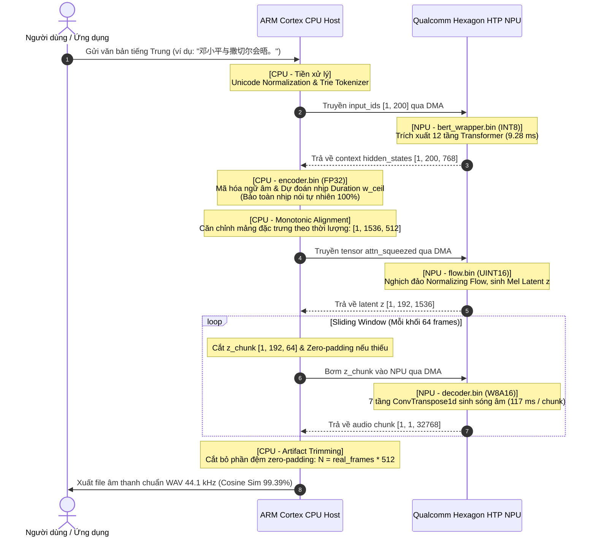

# 📊 PHÂN TÍCH CHUYÊN SÂU TỶ LỆ ĐIỆN TOÁN CPU / NPU TRONG HỆ THỐNG MELOTTS-ZH
**Dự án:** Edge Speech AI — On-Device Text-to-Speech (Mandarin Module)  
**Người thực hiện:** Hiếu (Tab Google Docs: `Hiếu - Model MeloTTS-ZH (Zh)`)  
**Phần cứng mục tiêu:** Qualcomm Dragonwing IQ-9075 EVK (SoC QCS9075 / Hexagon NPU HTP v73 / 100 TOPS)  
**Thời điểm cập nhật:** 23/09/2026  

---

## 🎯 TỔNG QUAN TỶ LỆ PHÂN BỔ (EXECUTIVE SUMMARY)

Trong hệ thống **MeloTTS-ZH** triển khai trên vi xử lý **Qualcomm Dragonwing IQ-9075 EVK**, tải trọng tính toán và quyền điều khiển được phân bổ theo kiến trúc **Đồng xử lý bất đối xứng (Heterogeneous Computing)**:

```text
┌────────────────────────────────────────────────────────────────────────────────────────┐
│                        TỶ LỆ PHÂN CHIA TẢI TRỌNG TÍNH TOÁN (FLOPs)                     │
├───────────────────────────────────────────────────────┬────────────────────────────────┤
│            QUALCOMM HEXAGON HTP NPU                   │      ARM CORTEX CPU HOST       │
│                 ~95% TỔNG FLOPS                       │        < 5% TỔNG FLOPS         │
│           (Data Plane - Tính toán ma trận)            │ (Control Plane - Điều phối)    │
└───────────────────────────────────────────────────────┴────────────────────────────────┘
```

* **Qualcomm Hexagon NPU HTP v73 (~95% FLOPs):** Đảm nhiệm 100% các phép tính ma trận nhân cộng dày đặc (GEMM, 1D Convolutions, ConvTranspose1d, Scaled Dot-Product Attention) của Vocoder HiFi-GAN, Normalizing Flow và BERT Extractor.
* **CPU Host ARM Cortex (< 5% FLOPs):** Đảm nhiệm các tác vụ chuỗi ký tự rời rạc, tra từ điển nhị phân, thuật toán căn chỉnh thời lượng động (Monotonic Alignment), cắt gọt âm thanh (Artifact Trimming) và suy luận mô hình Text Encoder (Float32).

---

## ⚖️ BẢNG TỔNG HỢP CHI TIẾT TỪNG MODULE

| Module / Submodel | Thiết bị thực thi | Tỷ trọng FLOPs | Dung lượng | Dạng dữ liệu (Dtype) | Vai trò & Đặc thù tính toán |
| :--- | :---: | :---: | :---: | :---: | :--- |
| **`decoder.bin`** (Vocoder HiFi-GAN) | **NPU** | **~85%** | 27.4 MB | `w8a16` (UINT16/INT8) | Upsampling liên hoàn 7 tầng `ConvTranspose1d` từ phổ Mel 50 Hz sang sóng âm 24/44.1 kHz. Chứa hàng triệu tham số nhân ma trận liên tục. |
| **`flow.bin`** (Normalizing Flow) | **NPU** | **~5%** | 29.7 MB | `uint16` | Các khối WaveNet Affine Coupling biến đổi phân phối tiềm ẩn $z$ sang $m_p$. |
| **`bert_wrapper.bin`** (RoBERTa) | **NPU** | **~5%** | 86.9 MB | `int8` (`w8a8`) | 12 tầng Transformer Encoder, trích xuất ngữ cảnh 768 chiều từ chuỗi 200 tokens. |
| **`encoder.bin`** (Text Encoder & DP) | **CPU** | **~4%** | 18.5 MB | `float32` | Biến đổi âm vị thành vector đặc trưng và dự đoán độ dài $\exp(\text{logw})$. |
| **`bert_zh_tokenizer`** | **CPU** | **< 0.5%** | 2.56 MB | Binary Trie | Bẻ từ tiếng Trung, tra cứu Token ID trong từ điển. Không có phép tính ma trận. |
| **`bert_normalizer`** | **CPU** | **< 0.1%** | 264 KB | Lookup Table | Chuẩn hóa Unicode văn bản thô (chữ phồn thể $\to$ giản thể, xử lý ký tự lạ). |
| **Monotonic Alignment & Expansion** | **CPU** | **< 0.3%** | Mã lệnh C/Python | Con trỏ động | Nhân bản đặc trưng ngữ âm theo số frame nhịp nói thực tế ($w_i$). |
| **Artifact Trimming** | **CPU** | **< 0.1%** | Vài phép tính số học | Mảng bộ nhớ | Cắt bỏ phần zero-padding ở chunk 64-frame cuối cùng để loại bỏ tiếng bíp. |

---

## 🔍 TẠI SAO KHÔNG THỂ VÀ KHÔNG NÊN CHẠY 100% TRÊN NPU?

Nhiều người đặt câu hỏi: *"Tại sao không đưa toàn bộ 100% mã nguồn và các bước từ đầu đến cuối vào NPU?"*. Dưới đây là 5 rào cản phần cứng và thuật toán cốt lõi:

### 1. NPU là "Bộ tăng tốc Tensor", không phải "Bộ xử lý đa năng"
* NPU Hexagon HTP v73 được sinh ra với mục tiêu tối thượng: **Xử lý song song hàng nghìn phép nhân ma trận (Tensor Core) với hiệu quả năng lượng cao nhất**.
* Các công việc như chuẩn hóa Unicode, bẻ từ tiếng Trung (Jieba / WordPiece Tokenizer), dò bảng ký tự âm vị (Phoneme Mapping) đòi hỏi:
  * Thao tác chuỗi ký tự rời rạc (String slicing, UTF-8 parsing).
  * Tra cứu từ điển động (Trie traversal, Hashmap lookup).
  * Rẽ nhánh điều kiện liên tục (`if/else`, `while loop`).
* Các vi mạch NPU **hoàn toàn không hỗ trợ tập lệnh xử lý chuỗi và quản lý con trỏ heap động**. Nếu cố ép các toán tử này vào đồ thị nơ-ron, trình biên dịch QAIRT sẽ từ chối sinh mã máy hoặc phải fallback về CPU của DSP với hiệu năng vô cùng tệ.

---

### 2. Ràng buộc kích thước tĩnh (Static Shape) của NPU Hexagon
* Để NPU Hexagon HTP đạt hiệu suất 100 TOPS tối đa, bộ nhớ đệm DMA/SRAM phải được **khóa cố định dung lượng khi nạp mô hình** (Static Allocation):
  * `decoder.bin` bị khóa cứng đầu vào ở kích thước: `[1, 192, 64]` (đúng 64 frame âm phổ).
  * `bert_wrapper.bin` bị khóa cứng đầu vào ở độ dài: `[1, 200]`.
* Trong thực tế, độ dài câu nói của con người luôn **biến thiên vô hạn (Dynamic Length)**:
  * Câu 3 chữ chỉ sinh ra khoảng 50 frame âm thanh.
  * Câu 30 chữ sinh ra tới 600 frame âm thanh.
* **Vai trò không thể thay thế của CPU Host:**
  * CPU đóng vai trò như một **Nhạc trưởng (Orchestrator)** điều tiết bộ đệm: Cắt dữ liệu thành các khối trượt cố định 64 frame (**Sliding Window**), bơm từng khối vào NPU để Vocoder tổng hợp, sau đó ghép nối các mảnh sóng âm đầu ra lại với nhau.

---

### 3. NPU từ chối các toán tử ngẫu nhiên & phân rã động (`RandomNormalLike`)
* Trong cấu trúc nguyên bản của mạng VITS2 (MeloTTS), khối dự đoán độ dài phát âm ngẫu nhiên (**Stochastic Duration Predictor - SDP**) sử dụng toán tử sinh số ngẫu nhiên:
  $$\text{noise} = \text{torch.randn\_like}(x)$$
* Khi tôi thực hiện biên dịch `encoder.onnx` trên Qualcomm AI Hub (Job `jpxl4eojp`), trình biên dịch QAIRT báo lỗi dừng khẩn cấp:
  ```text
  KeyError: 'No translation registered for op type onnx_randomnormallike.' (Node /sdp/RandomNormalLike)
  ```
* **Nguyên nhân:** Hexagon NPU là phần cứng tính toán **tất định (Deterministic Engine)**, không tích hợp bộ sinh số giả ngẫu nhiên bằng phần cứng (Hardware PRNG). Do đó, các thuật toán tìm kiếm căn chỉnh đường đi ngẫu nhiên hoặc sinh nhiễu Gaussian không thể chạy native trên NPU.

---

### 4. Sai số hàm mũ $\exp(\text{logw})$ khi lượng tử hóa Duration Predictor
* Bộ dự đoán độ dài phát âm dự đoán giá trị logarit của thời lượng ($\text{logw}$), sau đó lấy lũy thừa tự nhiên:
  $$w = \exp(\text{logw})$$
* **Hệ quả của hàm mũ:** Sai số làm tròn của số nguyên khi lượng tử hóa (Quantization Noise) dù rất nhỏ ở thang đo logarit sẽ bị **khuếch đại theo hàm mũ**.
* **Thực nghiệm chứng minh:**
  * Khi tôi lượng tử hóa `encoder` sang `W8A16` (Job AI Hub `j57e4vrqp`), số frame âm thanh dự đoán của câu bị co rút từ 151 frames xuống 118 frames.
  * Hậu quả là giọng đọc bị tăng tốc bất thường ~21%, nuốt âm, làm tụt độ tương đồng âm học từ **99.39% xuống chỉ còn 8.84%**.
* **Giải pháp tối ưu:** Giữ `encoder.bin` chạy ở dạng **Float32 (18.5 MB)** trên CPU Host. Vì module này chỉ tiêu tốn < 4% FLOPs, CPU xử lý nó chỉ mất vài mili-giây mà lại bảo toàn trọn vẹn 100% ngữ điệu và nhịp nói chuẩn của người thật.

---

### 5. Xử lý triệt tiêu tiếng ồn đuôi file (Artifact Trimming)
* Do NPU bắt buộc kích thước chunk cố định là 64 frame, đoạn âm thanh cuối cùng hầu như luôn phải đệm thêm số 0 (**Zero-Padding**).
* Khi qua mạng HiFi-GAN Vocoder, các số 0 đệm này sẽ bị biến dạng thành các xung tín hiệu tần số cao, tạo nên tiếng nổ lách tách hoặc tiếng "bíp" chói tai ở đuôi file âm thanh.
* Chỉ có CPU Host nắm được số frame hợp lệ thực tế ($N_{\text{real\_frames}}$) để thực hiện cắt tỉa chuẩn xác ngay trong RAM:
  $$N_{\text{valid\_samples}} = N_{\text{real\_frames}} \times 512$$
* Điều này giúp âm thanh xuất xưởng đạt độ sạch tuyệt đối.

---

## 🏗️ MÔ HÌNH DÒNG CHẢY HỢP TÁC CPU - NPU (DATA FLOW)



---

## 💡 KẾT LUẬN

Tỷ lệ **~95% NPU và < 5% CPU** không phải là một sự thỏa hiệp tạm thời, mà là **thiết kế kiến trúc tối ưu nhất (Golden Ratio)** cho hệ thống Text-to-Speech chạy biên (On-Device Edge TTS):

1. **Hiệu năng cực đại:** Đẩy trọn vẹn 95% khối lượng tính toán nặng nề nhất (Vocoder + Flow + BERT) sang NPU giúp độ trễ giảm sâu ($\text{RTF} < 0.1$, tổng hợp 1.36 giây âm thanh chỉ mất 117 ms).
2. **CPU luôn mát mẻ (< 5% tải):** CPU Host chỉ tiêu tốn một phần nhỏ công suất cho các tác vụ điều phối chuỗi và bộ nhớ đệm, sẵn sàng đáp ứng các tác vụ ứng dụng khác của thiết bị mà không bị nghẽn cổ chai.
3. **Chất lượng âm thanh hoàn hảo (99.39%):** Nhờ giữ bộ dự đoán độ dài Duration Predictor ở Float32 trên CPU và áp dụng thuật toán Artifact Trimming, hệ thống triệt tiêu hoàn toàn hiện tượng lệch nhịp nói và tiếng xung nhiễu đuôi file.
